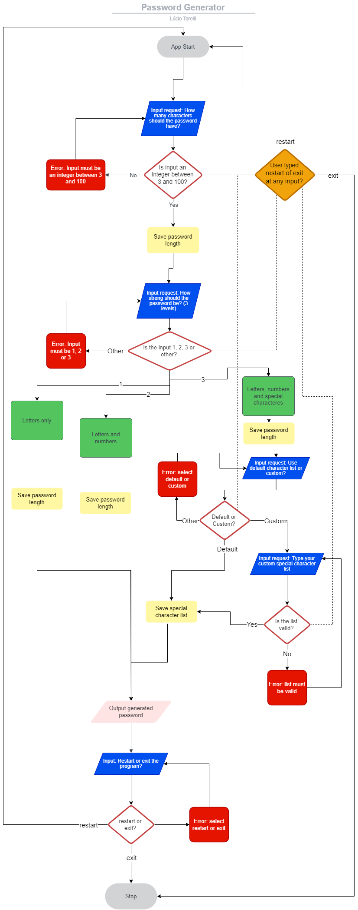

<h2><a href="" target="_blank">Live Website here</a></h2>

Password Generator
---

Password Generator is a Python app that runs on a terminal. It creates a password based on the amount of characters requested by the user and a password strength of 3 levels: 
1. Letters only.
2. Letters and numbers.
3. Letters, numbers and special characters.

## Table of Contents

1.  [Overview](https://github.com/luciotorelli/parrot-quiz#overview)
2.  [User Stories](https://github.com/luciotorelli/parrot-quiz#user-stories)
3.  [App Owner Goals](https://github.com/luciotorelli/parrot-quiz#site-owner-goals)
4.  [Chart](https://github.com/luciotorelli/parrot-quiz#wireframe)
5.  [Features](https://github.com/luciotorelli/parrot-quiz#features)
    - [Features](https://github.com/luciotorelli/parrot-quiz#features-1)
    - [Future Features](https://github.com/luciotorelli/parrot-quiz#future-features)
6.  [Technologies used](https://github.com/luciotorelli/parrot-quiz#technologies-used)
7.  [Testing](https://github.com/luciotorelli/parrot-quiz#testing)
    - [8.1 Code validation](https://github.com/luciotorelli/parrot-quiz#testing)
    - [8.2 Test cases (User Feedback - Screenshots)](https://github.com/luciotorelli/parrot-quiz#testing)
    - [8.3 Fixed Bugs](https://github.com/luciotorelli/parrot-quiz#testing)
    - [8.4 Open Bugs](https://github.com/luciotorelli/parrot-quiz#testing)
    - [8.5 Supported Screens and Browsers](https://github.com/luciotorelli/parrot-quiz#testing)
8.  [Deployment](https://github.com/luciotorelli/parrot-quiz#deployment)
9.  [Credits](https://github.com/luciotorelli/parrot-quiz#credits)
    - [10.1 Special Thanks!](https://github.com/luciotorelli/parrot-quiz#special-thanks)
    - [10.2 Resources used](https://github.com/luciotorelli/parrot-quiz#resources-used)
    - [10.3 Tutorials and Documentation used](https://github.com/luciotorelli/parrot-quiz#tutorials-and-documentation-used-no-code-were-copied-and-pasted-only-inspired-and-adapted)
    - [10.4 Imported library](https://github.com/luciotorelli/parrot-quiz#imported-library)

---

## User Stories

- As a new user I would like to generate a password based on my requirements.
- As a returning user I would like to generate a new password based on new requirements.
- As a user during the password generation, I would like to see any errors caused by my input and how I can fix them.

---

## Site Owner Goals:

- Create an app that will generate a password based on the user requirements.
- The app is easy to use and understand.
- The app should capture any user input errors, handle them and tell the user how to fix it. 

---

## Chart

---

## Features

   
Features

      1.      

   
Future Features

   1. 

---

## Technologies used

- 

---

## Testing

      

   
8.3 Fixed Bugs

   

   

---

## Deployment

---

## Credits

### Special Thanks!

