<h2><a href="https://password-generator-lucio.herokuapp.com" target="_blank">Live App here</a></h2>

Password Generator
---

Password Generator is a Python app that runs on a terminal. It creates a password based on the amount of characters requested by the user and a password strength of 3 levels: 
1. Letters only.
2. Letters and numbers.
3. Letters, numbers and special characters.

## Table of Contents

1.  [Overview](https://github.com/luciotorelli/parrot-quiz#overview)
2.  [User Stories](https://github.com/luciotorelli/parrot-quiz#user-stories)
3.  [App Owner Goals](https://github.com/luciotorelli/parrot-quiz#site-owner-goals)
4.  [Chart](https://github.com/luciotorelli/parrot-quiz#wireframe)
5.  [Features](https://github.com/luciotorelli/parrot-quiz#features)
    - [Features](https://github.com/luciotorelli/parrot-quiz#features-1)
    - [Future Features](https://github.com/luciotorelli/parrot-quiz#future-features)
6.  [Technologies used](https://github.com/luciotorelli/parrot-quiz#technologies-used)
7.  [Testing](https://github.com/luciotorelli/parrot-quiz#testing)
    - [8.1 Code validation](https://github.com/luciotorelli/parrot-quiz#testing)
    - [8.2 Test cases (User Feedback - Screenshots)](https://github.com/luciotorelli/parrot-quiz#testing)
    - [8.3 Fixed Bugs](https://github.com/luciotorelli/parrot-quiz#testing)
    - [8.4 Open Bugs](https://github.com/luciotorelli/parrot-quiz#testing)
    - [8.5 Supported Screens and Browsers](https://github.com/luciotorelli/parrot-quiz#testing)
8.  [Deployment](https://github.com/luciotorelli/parrot-quiz#deployment)
9.  [Credits](https://github.com/luciotorelli/parrot-quiz#credits)
    - [10.1 Special Thanks!](https://github.com/luciotorelli/parrot-quiz#special-thanks)
    - [10.2 Resources used](https://github.com/luciotorelli/parrot-quiz#resources-used)
    - [10.3 Tutorials and Documentation used](https://github.com/luciotorelli/parrot-quiz#tutorials-and-documentation-used-no-code-were-copied-and-pasted-only-inspired-and-adapted)
    - [10.4 Imported library](https://github.com/luciotorelli/parrot-quiz#imported-library)

---

## User Stories

- As a new user I would like to generate a password based on my requirements.
- As a returning user I would like to generate a new password based on new requirements.
- As a user during the password generation, I would like to see any errors caused by my input and how I can fix them.
- As a user running the program, I would like to restart or exit the program at any point.
- As a user selecting level 3 of password strength, I would like to choose my own special characters

---

## Site Owner Goals:

- Create an app that will generate a password based on the user requirements.
- The app is easy to use and understand.
- The app should capture any user input errors, handle them and tell the user how to fix it. 
- The app should allow the user to input their own special characters or use a pre-defined list
- The app should automatically handle any duplicated input by the user during the special character list input
- The app should allow the user to restart or exit the application during any input.

---

## Chart

---

## Features

   
Features

    1. In the first run the user is able to choose the quantity of characters their password should have.
    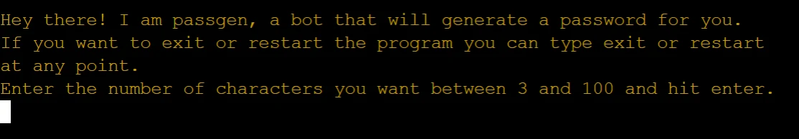
    2. If the user types any value other than an integer between 3 and 100 or exit and restart, an error is displayed.
    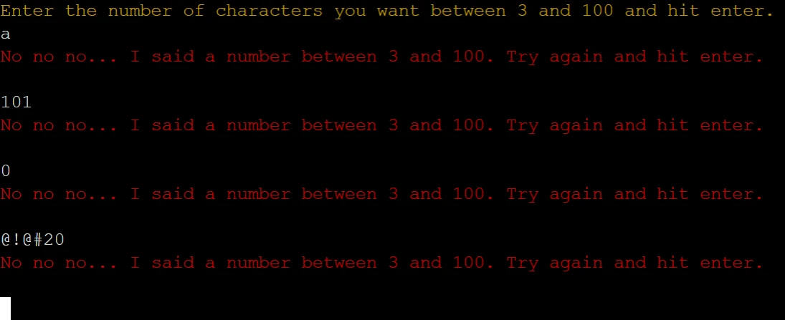
    3. If the user types exit or restart, the program will be exited or restarted respectively. They can do this at any input stage.
    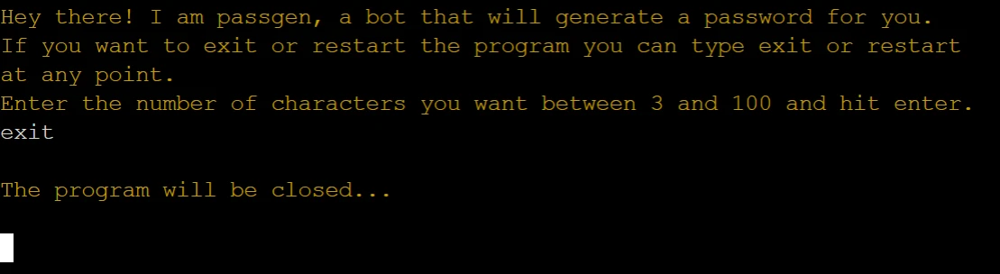
    4. Once the user selects the characters amount, they will be prompted to select a password strength level.
    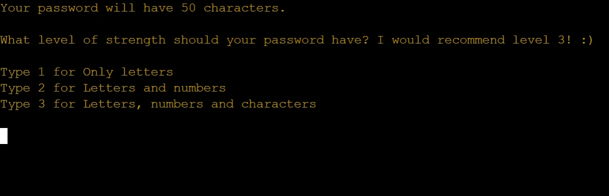
    5. If the user types anything other than 1, 2, 3, restart or exit, they will receive an error and be allowed to input again.
    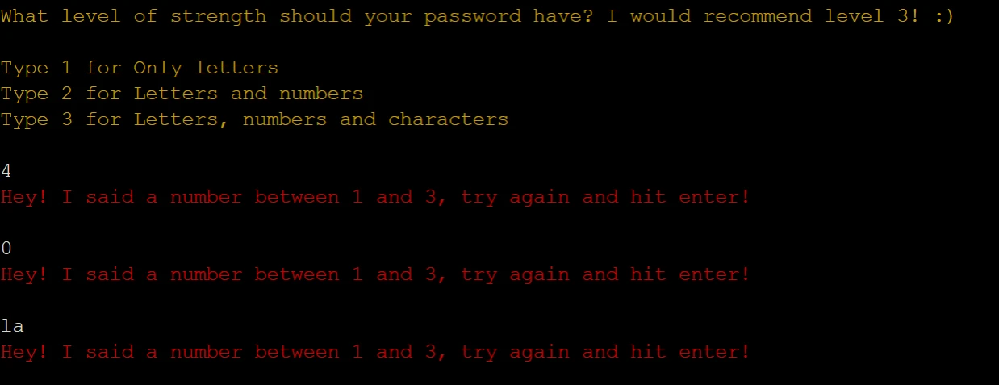
    6. If the user types 1, the password will be generated with letters only.
    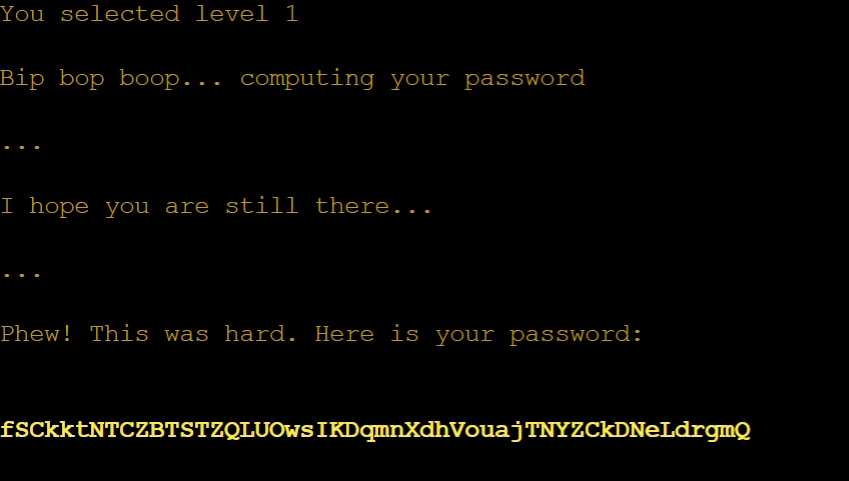
    7. If the user types 2, the password will be generated with letters and numbers.
    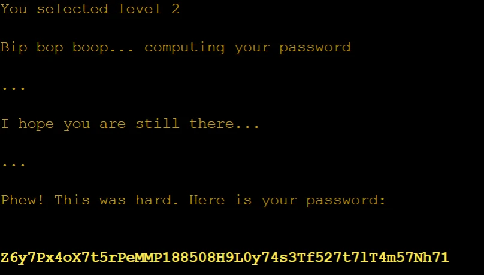
    8. If the user types 3, they will be able to type custom for a custom special character list or default to use the default list.
    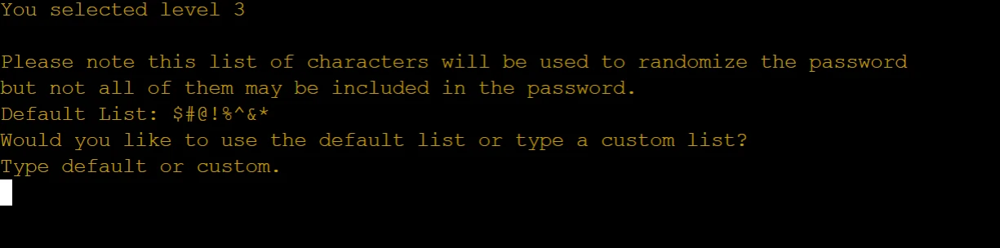
    9. If the user types anything other than custom, default, restart or exit, they will receive an error and be allowed to input again.
    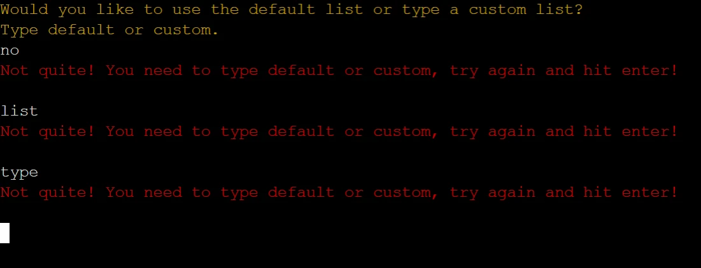
    10. If the user types default, a password will be generated using the default special character list.
    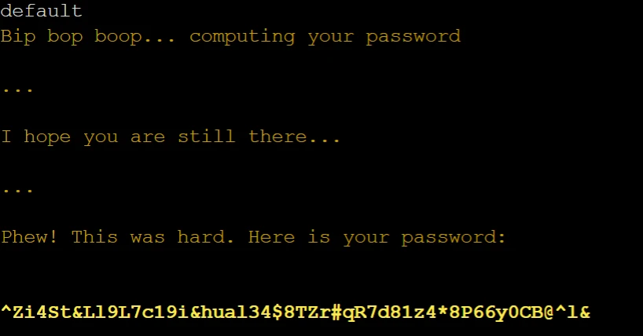
    11. If the user types custom, they will be able to type their own special character list.
    
    12. If the user types any character other than a special character or restart or exit, they will receive an error and be allowed to input again.
    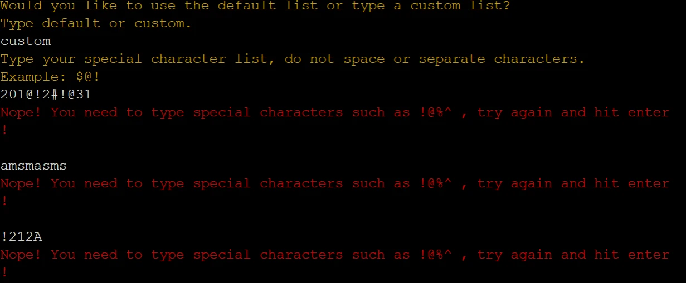
    13. Once the user inputs their special character list, a password will be generated. If the user inputs duplicate characters, the program will filter them.
    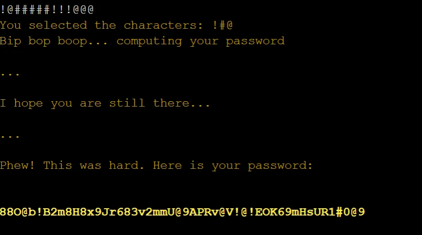
    14. Once the password is generated, the user can type yes to restart the program or no to stop the program.
    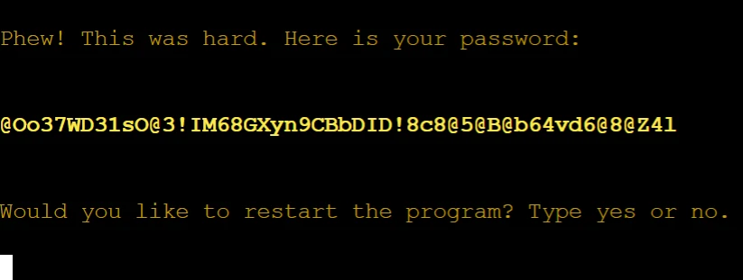
    15. If the user types anything other than yes, y, no, n, restart or exit, they will receive an error and be allowed to input again.
    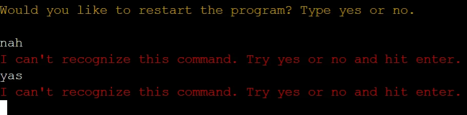    

   
Future Features

  
  1. Typing animation to make the bot look more lively, possible with a for loop but created further bugs that were not fixable within the time frame of the project.
  
  2. Allow the user to generate more than one password at the same time using the same parameters.
  
  3. Allow the user to go back on their input without restarting the entire application.

---

## Technologies used

- [Python](https://en.wikipedia.org/wiki/Python_(programming_language)) - Python is a high-level, general-purpose programming language.
- [Gitpod](https://www.gitpod.io/about) - Gitpod is an open source developer platform automating the provisioning of ready-to-code developer environments.
- [Heroku](https://dashboard.heroku.com/) - Heroku is a cloud platform as a service supporting several programming languages.
- [Github and Git](https://docs.github.com/en/get-started/using-git/about-git) - GitHub, Inc., is an Internet hosting service for software development and version control using Git.

---

## Imported libraries

- [random](https://docs.python.org/3/library/random.html) - This module implements pseudo-random number generators for various distributions. Used in this project to generate random integers, strings and characters.
- [string](https://docs.python.org/3/library/string.html) - Python String module contains some constants, utility function, and classes for string manipulation. Used in this project to manipulate the password.
- [time](https://docs.python.org/3/library/time.html) - This module provides various time-related functions. For related functionality, see also the datetime and calendar modules. Used in this project to sleep the program while the bot is typing the final messages.
- [pyfiglet](https://pypi.org/project/pyfiglet/0.7/) - pyfiglet is a full port of FIGlet into pure python. It takes ASCII text and renders it in ASCII art fonts. Used in this project to display the first message.
- [colorama](https://pypi.org/project/colorama/) - Makes ANSI escape character sequences (for producing colored terminal text and cursor positioning). Used in this project to differentiate errors from bot messages from user input.
- [os](https://docs.python.org/3/library/os.html) - This module provides a portable way of using operating system dependent functionality. Used in this project to clear the terminal in-between functions.

## Testing

      

   
8.3 Fixed Bugs

   

   

---

## Deployment

---

## Credits

### Special Thanks!

