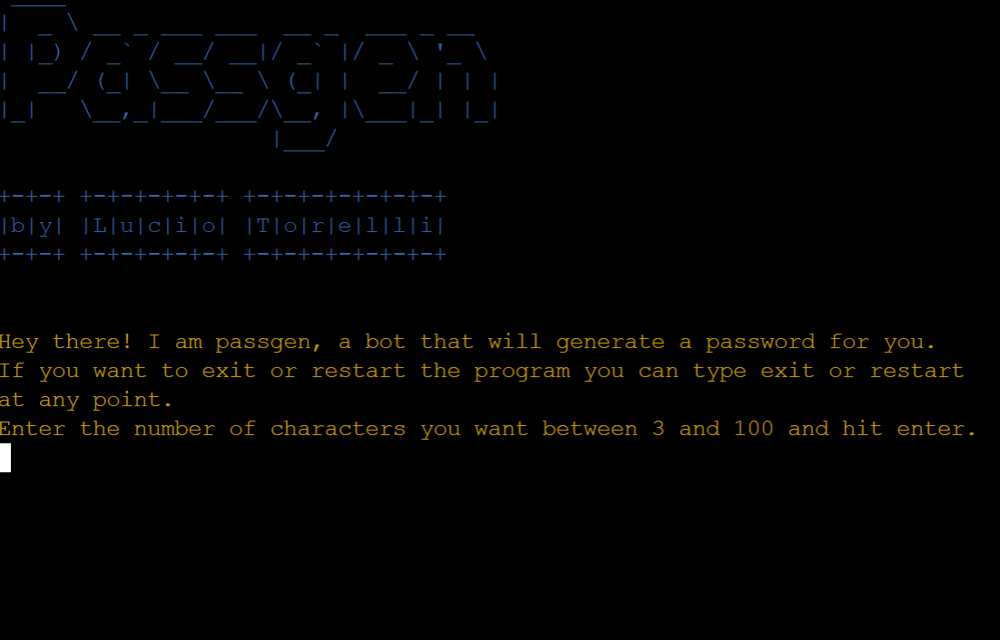
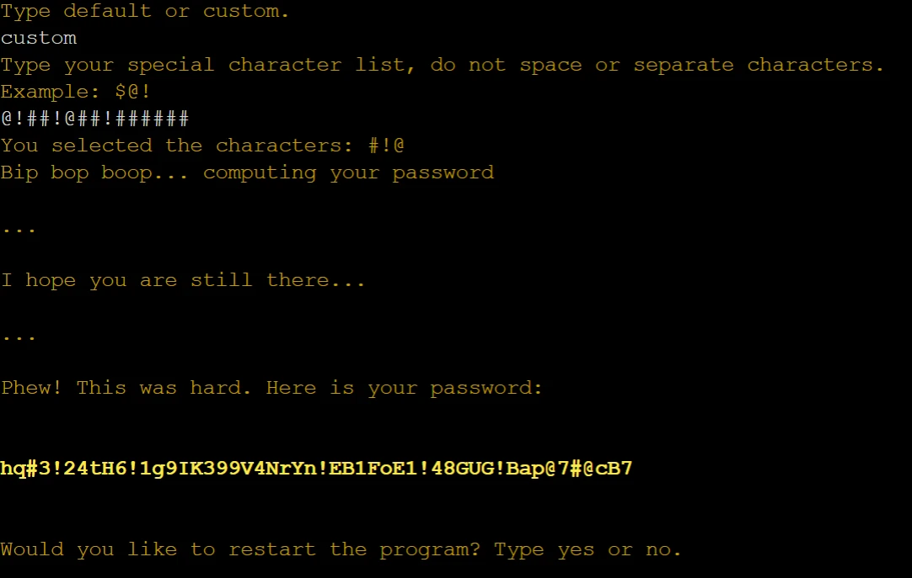
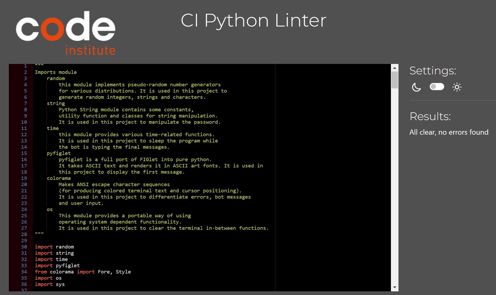
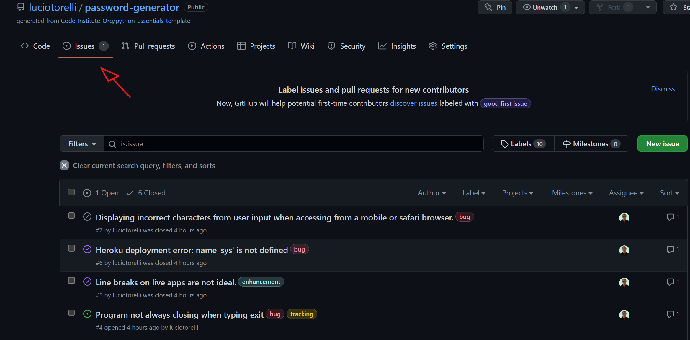

<h2><a href="https://password-generator-lucio.herokuapp.com" target="_blank">Live App here</a></h2>

Password Generator
---

Password Generator is a Python app that runs on a terminal. It creates a password based on the amount of characters requested by the user and a password strength of 3 levels: 
1. Letters only.
2. Letters and numbers.
3. Letters, numbers and special characters.

## Table of Contents

1.  [Overview](https://github.com/luciotorelli/password-generator#overview)
2.  [User Stories](https://github.com/luciotorelli/password-generator#user-stories)
3.  [App Owner Goals](https://github.com/luciotorelli/password-generator#site-owner-goals)
4.  [Chart](https://github.com/luciotorelli/password-generator#chart)
5.  [Features](https://github.com/luciotorelli/password-generator#features)
    - [Features](https://github.com/luciotorelli/password-generator#features-1)
    - [Future Features](https://github.com/luciotorelli/password-generator#future-features)
6.  [Technologies used](https://github.com/luciotorelli/password-generator#technologies-used)
7.  [Testing](https://github.com/luciotorelli/password-generator#testing)
    - [8.1 CI Python Linter](https://github.com/luciotorelli/password-generator#testing)
    - [8.2 Test cases](https://github.com/luciotorelli/password-generator#testing)
    - [8.3 Browser Compatibility](https://github.com/luciotorelli/password-generator#testing)
    - [8.4 Bugs](https://github.com/luciotorelli/password-generator#testing)
8.  [Deployment](https://github.com/luciotorelli/password-generator#deployment)
9.  [Credits](https://github.com/luciotorelli/password-generator#credits)
    - [10.1 Special Thanks!](https://github.com/luciotorelli/password-generator#special-thanks)
    - [10.2 Resources used](https://github.com/luciotorelli/password-generator#resources-used)
    - [10.3 Tutorials used](https://github.com/luciotorelli/password-generator#tutorials-used-no-code-were-copied-and-pasted-only-inspired-and-adapted)
    - [10.4 Imported library](https://github.com/luciotorelli/password-generator#imported-library)

---

## User Stories

- As a new user I would like to generate a password based on my requirements.
- As a returning user I would like to generate a new password based on new requirements.
- As a user inputting an answer, I would like to see any errors caused by my input and know how I can fix them.
- As a user running the program, I would like to restart or exit the program at any point.
- As a user selecting level 3 of password strength, I would like to choose my own special characters

---

## App Owner Goals:

- Create an app that will generate a password based on the user requirements.
- The app is easy to use and understand.
- The app should capture any user input errors, handle them and tell the user how to fix it.
- The app should allow the user to input their own special characters or use a pre-defined list
- The app should automatically handle any duplicated input by the user during the special character list input
- The app should allow the user to restart or exit the application during any input.

---

## Chart

---

## Features

   
Features

    1. In the first run the user is able to choose the quantity of characters their password should have.
    
    2. If the user types any value other than an integer between 3 and 100 or exit and restart, an error is displayed.
    
    3. If the user types exit or restart, the program will be exited or restarted respectively. They can do this at any input stage.
    
    4. Once the user selects the characters amount, they will be prompted to select a password strength level.
    
    5. If the user types anything other than 1, 2, 3, restart or exit, they will receive an error and be allowed to input again.
    
    6. If the user types 1, the password will be generated with letters only.
    
    7. If the user types 2, the password will be generated with letters and numbers.
    
    8. If the user types 3, they will be able to type custom for a custom special character list or default to use the default list.
    
    9. If the user types anything other than custom, default, restart or exit, they will receive an error and be allowed to input again.
    
    10. If the user types default, a password will be generated using the default special character list.
    
    11. If the user types custom, they will be able to type their own special character list.
    
    12. If the user types any character other than a special character or restart or exit, they will receive an error and be allowed to input again.
    
    13. Once the user inputs their special character list, a password will be generated. If the user inputs duplicate characters, the program will filter them.
    
    14. Once the password is generated, the user can type yes to restart the program or no to stop the program.
    
    15. If the user types anything other than yes, y, no, n, restart or exit, they will receive an error and be allowed to input again.
        

   
Future Features

  
  1. Typing animation to make the bot look more lively, possible with a for loop but created further bugs that were not fixable within the time frame of the project.
  
  2. Allow the user to generate more than one password at the same time using the same parameters.
  
  3. Allow the user to go back on their input without restarting the entire application.

---

## Technologies used

- [Python](https://en.wikipedia.org/wiki/Python_(programming_language)) - Python is a high-level, general-purpose programming language.
- [Gitpod](https://www.gitpod.io/about) - Gitpod is an open source developer platform automating the provisioning of ready-to-code developer environments.
- [Heroku](https://dashboard.heroku.com/) - Heroku is a cloud platform as a service supporting several programming languages.
- [Github and Git](https://docs.github.com/en/get-started/using-git/about-git) - GitHub, Inc., is an Internet hosting service for software development and version control using Git.

---

## Testing

### CI Python Linter
   run.py was validated using the <a href="https://pep8ci.herokuapp.com">provided CI Python Linter</a>, passed with no errors.
   

 

### Test Cases
| Case | Screenshot    | Achieved |
| :---:   | :---: | :---: |
| As a new user I would like to generate a password based on my requirements. |    | Yes   |
| As a returning user I would like to generate a new password based on new requirements. |    | Yes   |
| As a user inputting an answer, I would like to see any errors caused by my input and know how I can fix them. |    | Yes   |
| As a user running the program, I would like to restart or exit the program at any point. |    | Yes   |
| As a new user I would like to generate a password based on my requirements. |    | Yes   |
| As a user selecting level 3 of password strength, I would like to choose my own special characters. |    | Yes   |
---

 

### Browser Compatibility

| Browser | Compatible    | Notes |
| :---:   | :---: | :---: |
| Chrome Desktop | Yes  | N/A   |
| Opera Desktop | Yes  | N/A   |
| Edge Desktop | Yes  | N/A   |
| Firefox Desktop | Yes  | N/A   |
| Mobile Browsers | No  | See [Issue 7](https://github.com/luciotorelli/password-generator/issues/7) for more details   |
| Safari Desktop or Mobile | No  | See [Issue 7](https://github.com/luciotorelli/password-generator/issues/7) for more details   |

---

 

### Bugs

Bugs were logged using GitHub native bug tracking system. All logged bugs can be [viewed here.](https://github.com/luciotorelli/password-generator/issues?q=is%3Aissue)

---

## Deployment

Code Institute provided a [mockup terminal template](https://github.com/Code-Institute-Org/python-essentials-template) to view the application in the frontend since it is a backend, terminal-based project.

### Local
VSCode windows was used to write the program.

1. Head to the Github of the terminal template provided.
2. Click on Use this template
3. Click on Create new repository
4. Select a repository name and click on create.
5. Once the repository is created, open the command pallet and type git clone https://github.com/luciotorelli/password-generator
6. The file requirements.txt needs to be updated with your own packages. To update it head to the terminal on VSCode or Gitpod and type pip3 freeze --local > requirements.txt

* The [Git Graph](https://marketplace.visualstudio.com/items?itemName=mhutchie.git-graph) VS code extension was used to manage git and push commits to GitHub.
* Gitpod was temporarily used to share the code with tutors, git clone can also be used or the Gitpod extension.

### Heroku

1. Create a user account with Heroku
2. Click New in the top-right corner of your Heroku Dashboard.
3. Click on the dropdown menu and select create new.
4. The app name is unique to all apps within Heroku so select one that is not currently in use.
5. Select a region, EU or USA.
6. Click Create App.
7. In the app settings click Reveal Config vars, set the value of KEY to PORT, and the value to 8000 and click add.
8. Click Add Buildpack.
9. Choose Python first and click add.
10. Choose Node.js second.
11. The order is important, Python needs to be first, then Node.js second.
12. Click on the Deploy tab, select connect to Github and search for your repository.
13. Click on Enable automatic deploy or Deploy branch depending on your use case.

---

## Credits

### Special Thanks!

- Can Code Institutor Mentor - I am very grateful for the guidance provided by Can for my project.
- My colleague group - Thanks for testing my project on multiple devices and providing feedback during development.
- My family and friends that were kind enough to test the terminal app on their devices and provide me with feedback and screenshots.
- My study group for sharing the struggles/challenges and keeping each other progressing! ([@alexiiasantos](https://github.com/alexiiasantos), Bohdan, [@GaryS007](https://github.com/GaryS007), [@oconnorian3](https://github.com/oconnorian3), [@James-Fitz](https://github.com/James-Fitz), [@zemaciel](https://github.com/zemaciel), Thomas and Yanina)

### Resources used

  - [Code Institute Full Stack - Course material, mentoring and tutoring](https://codeinstitute.net/ie/full-stack-software-development-diploma/)
  - [Stackoverflow - Having the answers to many of my questions](https://stackoverflow.com/)
  - [draw.io (diagrams) - Used to draw the chart of the project](https://app.diagrams.net/)
  - [CI Python Linter - Used to check the run.py file against pep8](https://pep8ci.herokuapp.com/#)
  - [VScode - Used to write the code for this project](https://code.visualstudio.com/)
  - [Gitpod - Used to share a virtual enviroment with tutors.](https://gitpod.io/workspaces)
  - [YouTube Music - Used to listen to hours of lofi song during the project development](https://music.youtube.com/)

### Tutorials used (No code was copied and pasted, only inspired or adapted)

   - [Shuffle a list, string, tuple in Python.](https://note.nkmk.me/en/python-random-shuffle)
   - [Clear terminal screen.](https://www.quora.com/Is-there-a-Clear-screen-function-in-Python)
   - [Documenting Python Code: A Complete Guide.](https://realpython.com/documenting-python-code/)
   - [Check if Python List Contains All Elements of Another List.](https://techbeamers.com/program-python-list-contains-elements/)

### Imported libraries

- [random](https://docs.python.org/3/library/random.html) - This module implements pseudo-random number generators for various distributions. Used in this project to generate random integers, strings and characters.
- [string](https://docs.python.org/3/library/string.html) - Python String module contains some constants, utility function, and classes for string manipulation. Used in this project to manipulate the password.
- [time](https://docs.python.org/3/library/time.html) - This module provides various time-related functions. For related functionality, see also the datetime and calendar modules. Used in this project to sleep the program while the bot is typing the final messages.
- [pyfiglet](https://pypi.org/project/pyfiglet/0.7/) - pyfiglet is a full port of FIGlet into pure python. It takes ASCII text and renders it in ASCII art fonts. Used in this project to display the first message.
- [colorama](https://pypi.org/project/colorama/) - Makes ANSI escape character sequences (for producing colored terminal text and cursor positioning). Used in this project to differentiate errors from bot messages from user input.
- [os](https://docs.python.org/3/library/os.html) - This module provides a portable way of using operating system dependent functionality. Used in this project to clear the terminal in-between functions.

---